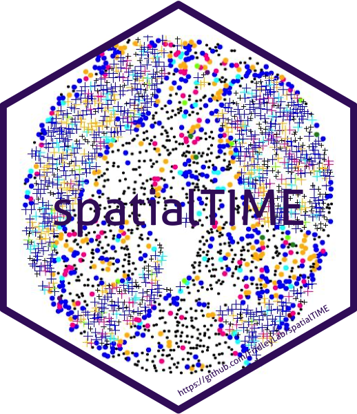

<!-- badges: start -->

[](https://CRAN.R-project.org/package=spatialTIME)
[](https://CRAN.R-project.org/package=spatialTIME)
[](https://CRAN.R-project.org/package=spatialTIME)

<!-- badges: end -->

<!--
Other badges
[](https://github.com/fridleylab/spatialTIME/actions)
-->

# spatialTIME 

<!-- badges: start -->
<!-- badges: end -->

The goal of `spatialTIME` is to perform basic analysis and plotting of
IF data from Vectra.

## Installation

You can install `spatialTIME` from GitHub with:

``` r
# install.packages("devtools")
devtools::install_github("fridleylab/spatialTIME")
```

<!--- add CRAN once up and running --->

## Usage

`spatialTIME` currently implements both univariate and bi-variate
Ripley’s K analyses. The basis of the `spatialTIME` functions is the
creation of the `mif` object.

``` r
x <- create_mif(clinical_data = example_clinical,
                sample_data = example_summary,
                spatial_list = example_spatial,
                patient_id = "deidentified_id", sample_id = "deidentified_sample",
                clean_columns = TRUE)
x
## 229 patients spanning 229 samples and 5 spatial data frames were found
```

## Additional resources

For a more in-depth description of the methods used, please see the
included vignette.

For a point-and-click resource that performs related analyses please
check out [iTIME](https://fridleylab.shinyapps.io/iTIME/).
