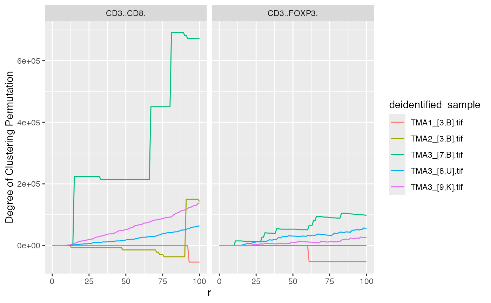
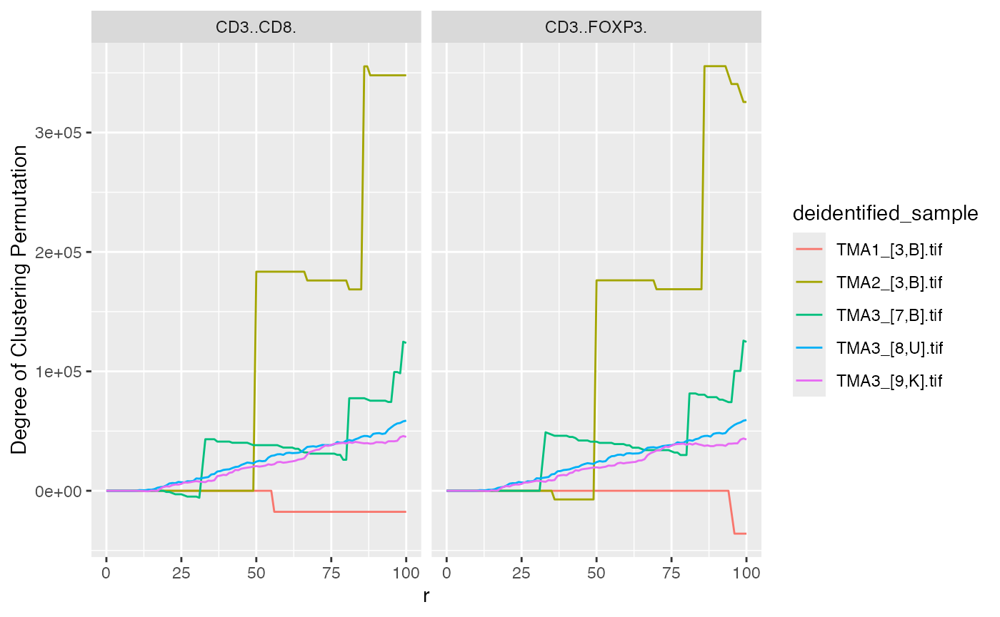
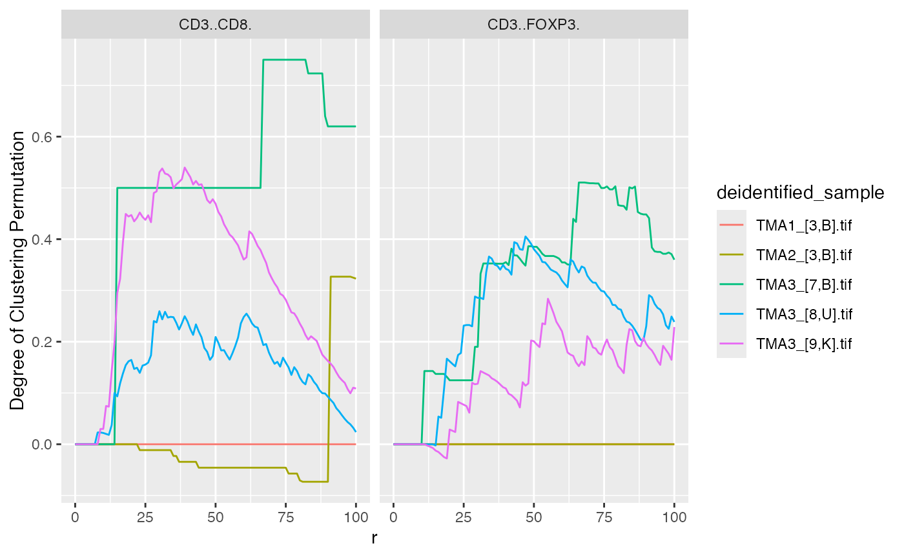
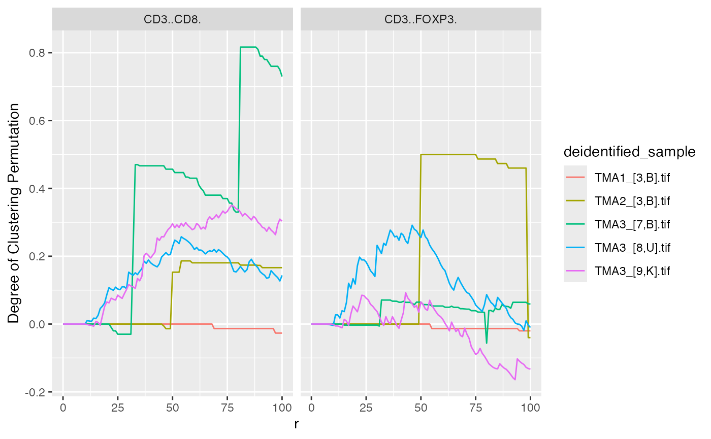
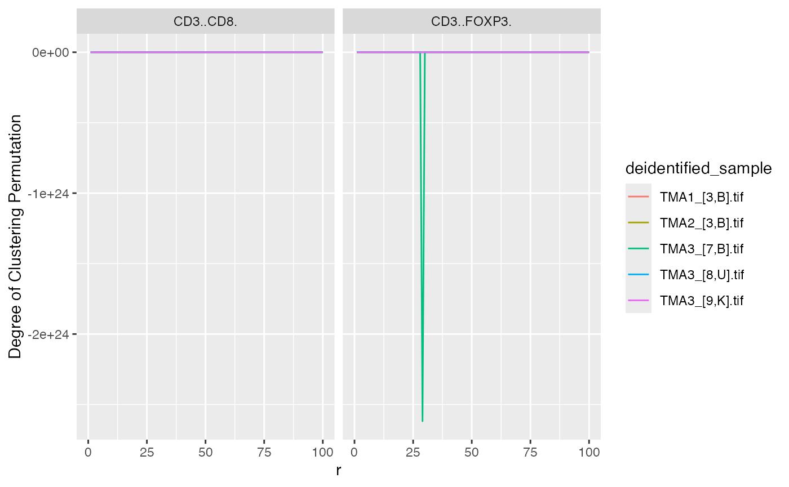
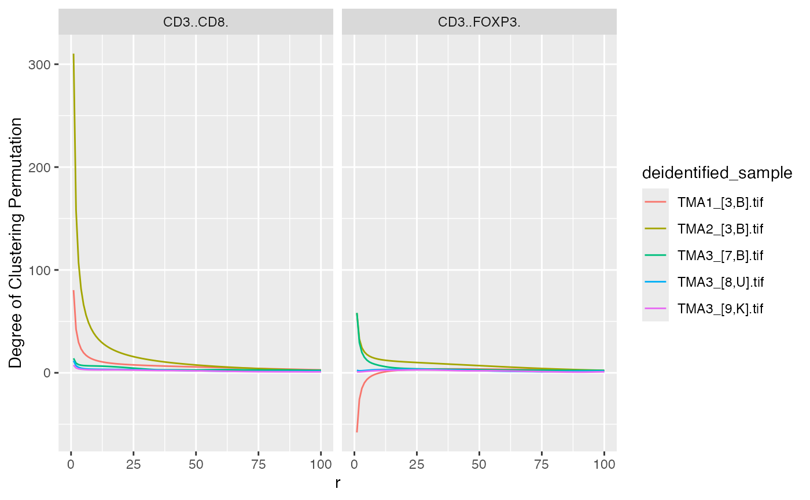
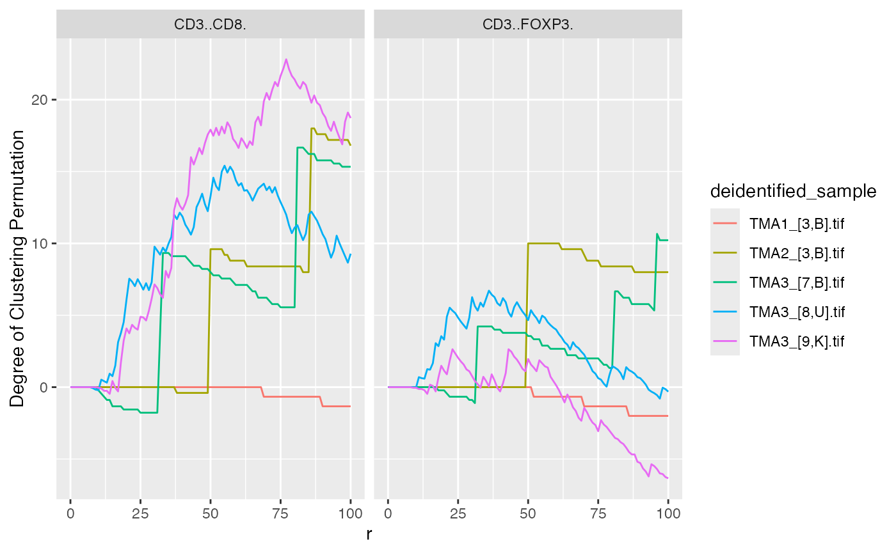
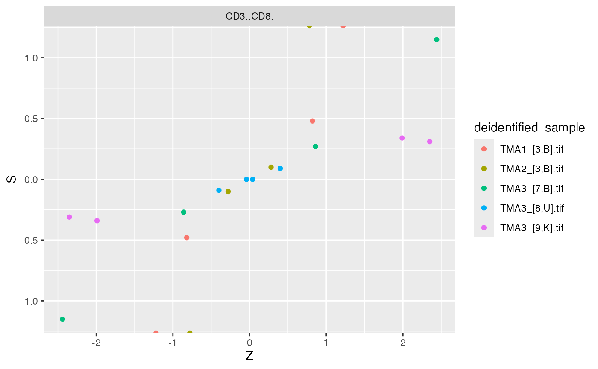
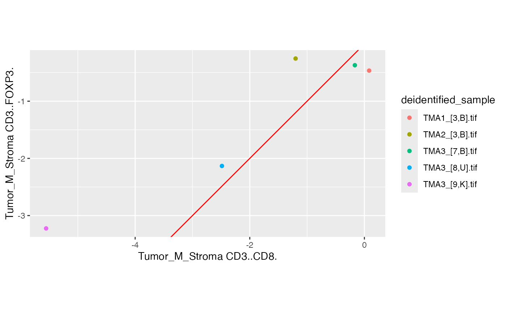

# Deriving Functions

This is going to be a short vignette for the use of the functions used
to derive spatial metrics.

``` r

library(dplyr)
#> 
#> Attaching package: 'dplyr'
#> The following objects are masked from 'package:stats':
#> 
#>     filter, lag
#> The following objects are masked from 'package:base':
#> 
#>     intersect, setdiff, setequal, union
library(ggplot2)
devtools::load_all()
#> ℹ Loading spatialTIME
#> spatialTIME version:
#> 2.1.0
#> If using for publication, please cite our manuscript:
#> https://doi.org/10.1093/bioinformatics/btab757
mif = create_mif(clinical_data = example_clinical %>% 
                   mutate(deidentified_id = as.character(deidentified_id)),
                 sample_data = example_summary %>% 
                   mutate(deidentified_id = as.character(deidentified_id)),
                 spatial_list = example_spatial,
                 patient_id = "deidentified_id", 
                 sample_id = "deidentified_sample")

markers = colnames(mif$spatial[[1]]) %>% 
  grep("CD3|Pos", ., value = T) %>% 
  grep("Cyto|Nucle", ., value = T, invert = T)
markers = markers[c(1,2,4,5,8)]
```

## Ripley’s K

### Univariate

``` r

mif = ripleys_k(mif = mif,
                mnames = markers[1:2], 
                r_range = 0:100, 
                num_permutations = 25,
                edge_correction = 'translation', 
                permute = TRUE, 
                keep_permutation_distribution = FALSE, 
                workers = 1, 
                overwrite = TRUE, 
                xloc = NULL, 
                yloc = NULL)
mif$derived$univariate_Count %>%
  ggplot() +
  geom_line(aes(x = r, y = `Degree of Clustering Permutation`, color = deidentified_sample)) +
  facet_grid(~Marker)
```



### Bivariate

``` r

mif = bi_ripleys_k(mif = mif, 
                   mnames = markers[1:2],
                   r_range = 0:100,
                   num_permutations = 25,
                   edge_correction = "translation",
                   permute = TRUE,
                   keep_permutation_distribution = FALSE,
                   workers = 1, 
                   overwrite = TRUE,
                   xloc = NULL, 
                   yloc = NULL)

mif$derived$bivariate_Count %>%
  ggplot() +
  geom_line(aes(x = r, y = `Degree of Clustering Permutation`, color = deidentified_sample)) +
  facet_grid(~Anchor)
```



## Nearest Neighbor G

### Univariate

``` r

mif = NN_G(mif = mif, 
           mnames = markers[1:2], 
           r_range = 0:100, 
           num_permutations = 25, 
           edge_correction = "rs", 
           keep_permutation_distribution = FALSE, 
           workers = 1, 
           overwrite = TRUE, 
           xloc = NULL,
           yloc = NULL)

mif$derived$univariate_NN %>%
  ggplot() +
  geom_line(aes(x = r, y = `Degree of Clustering Permutation`, color = deidentified_sample)) +
  facet_grid(~Marker)
```



### Bivariate

``` r

mif = bi_NN_G(mif = mif, 
           mnames = markers[1:2], 
           r_range = 0:100, 
           num_permutations = 25, 
           edge_correction = "rs", 
           keep_permutation_distribution = FALSE, 
           workers = 1, 
           overwrite = TRUE, 
           xloc = NULL,
           yloc = NULL)

mif$derived$bivariate_NN %>%
  ggplot() +
  geom_line(aes(x = r, y = `Degree of Clustering Permutation`, color = deidentified_sample)) +
  facet_grid(~Anchor)
```



## Pair Correlation g

### Univariate

``` r

mif = pair_correlation(mif = mif, 
                       mnames = markers[1:2],
                       r_range = 0:100, 
                       num_permutations = 25, 
                       edge_correction = "translation", 
                       keep_permutation_distribution = FALSE, 
                       workers = 1, 
                       overwrite = TRUE, 
                       xloc = NULL, 
                       yloc = NULL)
#> Warning: default settings have changed for pcf.ppp in spatstat.explore >= 3.8-1
#> Warning in min(x): no non-missing arguments to min; returning Inf
#> Warning in max(x): no non-missing arguments to max; returning -Inf
#> Warning in min(x): no non-missing arguments to min; returning Inf
#> Warning in max(x): no non-missing arguments to max; returning -Inf
#> Warning in min(x): no non-missing arguments to min; returning Inf
#> Warning in max(x): no non-missing arguments to max; returning -Inf
#> Warning in min(x): no non-missing arguments to min; returning Inf
#> Warning in max(x): no non-missing arguments to max; returning -Inf
#> Warning in min(x): no non-missing arguments to min; returning Inf
#> Warning in max(x): no non-missing arguments to max; returning -Inf
#> Warning in min(x): no non-missing arguments to min; returning Inf
#> Warning in max(x): no non-missing arguments to max; returning -Inf
#> Warning in min(x): no non-missing arguments to min; returning Inf
#> Warning in max(x): no non-missing arguments to max; returning -Inf
#> Warning in min(x): no non-missing arguments to min; returning Inf
#> Warning in max(x): no non-missing arguments to max; returning -Inf
#> Warning in min(x): no non-missing arguments to min; returning Inf
#> Warning in max(x): no non-missing arguments to max; returning -Inf
#> Warning in min(x): no non-missing arguments to min; returning Inf
#> Warning in max(x): no non-missing arguments to max; returning -Inf
#> Warning in min(x): no non-missing arguments to min; returning Inf
#> Warning in max(x): no non-missing arguments to max; returning -Inf
#> Warning in min(x): no non-missing arguments to min; returning Inf
#> Warning in max(x): no non-missing arguments to max; returning -Inf
#> Warning in min(x): no non-missing arguments to min; returning Inf
#> Warning in max(x): no non-missing arguments to max; returning -Inf
#> Warning in min(x): no non-missing arguments to min; returning Inf
#> Warning in max(x): no non-missing arguments to max; returning -Inf
#> Warning in min(x): no non-missing arguments to min; returning Inf
#> Warning in max(x): no non-missing arguments to max; returning -Inf
#> Warning in min(x): no non-missing arguments to min; returning Inf
#> Warning in max(x): no non-missing arguments to max; returning -Inf
#> Warning in min(x): no non-missing arguments to min; returning Inf
#> Warning in max(x): no non-missing arguments to max; returning -Inf
#> Warning in min(x): no non-missing arguments to min; returning Inf
#> Warning in max(x): no non-missing arguments to max; returning -Inf
#> Warning in min(x): no non-missing arguments to min; returning Inf
#> Warning in max(x): no non-missing arguments to max; returning -Inf
#> Warning in min(x): no non-missing arguments to min; returning Inf
#> Warning in max(x): no non-missing arguments to max; returning -Inf
#> Warning in min(x): no non-missing arguments to min; returning Inf
#> Warning in max(x): no non-missing arguments to max; returning -Inf
#> Warning in min(x): no non-missing arguments to min; returning Inf
#> Warning in max(x): no non-missing arguments to max; returning -Inf
#> Warning in min(x): no non-missing arguments to min; returning Inf
#> Warning in max(x): no non-missing arguments to max; returning -Inf
#> Warning in min(x): no non-missing arguments to min; returning Inf
#> Warning in max(x): no non-missing arguments to max; returning -Inf
#> Warning in min(x): no non-missing arguments to min; returning Inf
#> Warning in max(x): no non-missing arguments to max; returning -Inf
#> Warning in min(x): no non-missing arguments to min; returning Inf
#> Warning in max(x): no non-missing arguments to max; returning -Inf
#> Warning in min(x): no non-missing arguments to min; returning Inf
#> Warning in max(x): no non-missing arguments to max; returning -Inf
#> Warning in min(x): no non-missing arguments to min; returning Inf
#> Warning in max(x): no non-missing arguments to max; returning -Inf
#> Warning in min(x): no non-missing arguments to min; returning Inf
#> Warning in max(x): no non-missing arguments to max; returning -Inf
#> Warning in min(x): no non-missing arguments to min; returning Inf
#> Warning in max(x): no non-missing arguments to max; returning -Inf
#> Warning in min(x): no non-missing arguments to min; returning Inf
#> Warning in max(x): no non-missing arguments to max; returning -Inf
#> Warning in min(x): no non-missing arguments to min; returning Inf
#> Warning in max(x): no non-missing arguments to max; returning -Inf
#> Warning in min(x): no non-missing arguments to min; returning Inf
#> Warning in max(x): no non-missing arguments to max; returning -Inf
#> Warning in min(x): no non-missing arguments to min; returning Inf
#> Warning in max(x): no non-missing arguments to max; returning -Inf
#> Warning in min(x): no non-missing arguments to min; returning Inf
#> Warning in max(x): no non-missing arguments to max; returning -Inf
#> Warning in min(x): no non-missing arguments to min; returning Inf
#> Warning in max(x): no non-missing arguments to max; returning -Inf
#> Warning in min(x): no non-missing arguments to min; returning Inf
#> Warning in max(x): no non-missing arguments to max; returning -Inf
#> Warning in min(x): no non-missing arguments to min; returning Inf
#> Warning in max(x): no non-missing arguments to max; returning -Inf
#> Warning in min(x): no non-missing arguments to min; returning Inf
#> Warning in max(x): no non-missing arguments to max; returning -Inf
#> Warning in min(x): no non-missing arguments to min; returning Inf
#> Warning in max(x): no non-missing arguments to max; returning -Inf
#> Warning in min(x): no non-missing arguments to min; returning Inf
#> Warning in max(x): no non-missing arguments to max; returning -Inf
#> Warning in min(x): no non-missing arguments to min; returning Inf
#> Warning in max(x): no non-missing arguments to max; returning -Inf
#> Warning in min(x): no non-missing arguments to min; returning Inf
#> Warning in max(x): no non-missing arguments to max; returning -Inf
#> Warning in min(x): no non-missing arguments to min; returning Inf
#> Warning in max(x): no non-missing arguments to max; returning -Inf
#> Warning in min(x): no non-missing arguments to min; returning Inf
#> Warning in max(x): no non-missing arguments to max; returning -Inf
#> Warning in min(x): no non-missing arguments to min; returning Inf
#> Warning in max(x): no non-missing arguments to max; returning -Inf
#> Warning in min(x): no non-missing arguments to min; returning Inf
#> Warning in max(x): no non-missing arguments to max; returning -Inf
#> Warning in min(x): no non-missing arguments to min; returning Inf
#> Warning in max(x): no non-missing arguments to max; returning -Inf
#> Warning in min(x): no non-missing arguments to min; returning Inf
#> Warning in max(x): no non-missing arguments to max; returning -Inf
#> Warning in min(x): no non-missing arguments to min; returning Inf
#> Warning in max(x): no non-missing arguments to max; returning -Inf
#> Warning in min(x): no non-missing arguments to min; returning Inf
#> Warning in max(x): no non-missing arguments to max; returning -Inf
#> Warning in min(x): no non-missing arguments to min; returning Inf
#> Warning in max(x): no non-missing arguments to max; returning -Inf
#> Warning in min(x): no non-missing arguments to min; returning Inf
#> Warning in max(x): no non-missing arguments to max; returning -Inf
#> Warning in min(x): no non-missing arguments to min; returning Inf
#> Warning in max(x): no non-missing arguments to max; returning -Inf
#> Warning in min(x): no non-missing arguments to min; returning Inf
#> Warning in max(x): no non-missing arguments to max; returning -Inf
#> Warning in min(x): no non-missing arguments to min; returning Inf
#> Warning in max(x): no non-missing arguments to max; returning -Inf
#> Warning in min(x): no non-missing arguments to min; returning Inf
#> Warning in max(x): no non-missing arguments to max; returning -Inf
#> Warning in min(x): no non-missing arguments to min; returning Inf
#> Warning in max(x): no non-missing arguments to max; returning -Inf
#> Warning in min(x): no non-missing arguments to min; returning Inf
#> Warning in max(x): no non-missing arguments to max; returning -Inf
#> Warning in min(x): no non-missing arguments to min; returning Inf
#> Warning in max(x): no non-missing arguments to max; returning -Inf
#> Warning in min(x): no non-missing arguments to min; returning Inf
#> Warning in max(x): no non-missing arguments to max; returning -Inf
#> Warning in min(x): no non-missing arguments to min; returning Inf
#> Warning in max(x): no non-missing arguments to max; returning -Inf
#> Warning in min(x): no non-missing arguments to min; returning Inf
#> Warning in max(x): no non-missing arguments to max; returning -Inf
#> Warning in min(x): no non-missing arguments to min; returning Inf
#> Warning in max(x): no non-missing arguments to max; returning -Inf
#> Warning in min(x): no non-missing arguments to min; returning Inf
#> Warning in max(x): no non-missing arguments to max; returning -Inf
#> Warning in min(x): no non-missing arguments to min; returning Inf
#> Warning in max(x): no non-missing arguments to max; returning -Inf
#> Warning in min(x): no non-missing arguments to min; returning Inf
#> Warning in max(x): no non-missing arguments to max; returning -Inf
#> Warning in min(x): no non-missing arguments to min; returning Inf
#> Warning in max(x): no non-missing arguments to max; returning -Inf
#> Warning in min(x): no non-missing arguments to min; returning Inf
#> Warning in max(x): no non-missing arguments to max; returning -Inf
#> Warning in min(x): no non-missing arguments to min; returning Inf
#> Warning in max(x): no non-missing arguments to max; returning -Inf
#> Warning in min(x): no non-missing arguments to min; returning Inf
#> Warning in max(x): no non-missing arguments to max; returning -Inf
#> Warning in min(x): no non-missing arguments to min; returning Inf
#> Warning in max(x): no non-missing arguments to max; returning -Inf
#> Warning in min(x): no non-missing arguments to min; returning Inf
#> Warning in max(x): no non-missing arguments to max; returning -Inf
#> Warning in min(x): no non-missing arguments to min; returning Inf
#> Warning in max(x): no non-missing arguments to max; returning -Inf
#> Warning in min(x): no non-missing arguments to min; returning Inf
#> Warning in max(x): no non-missing arguments to max; returning -Inf
#> Warning in min(x): no non-missing arguments to min; returning Inf
#> Warning in max(x): no non-missing arguments to max; returning -Inf
#> Warning in min(x): no non-missing arguments to min; returning Inf
#> Warning in max(x): no non-missing arguments to max; returning -Inf
#> Warning in min(x): no non-missing arguments to min; returning Inf
#> Warning in max(x): no non-missing arguments to max; returning -Inf
#> Warning in min(x): no non-missing arguments to min; returning Inf
#> Warning in max(x): no non-missing arguments to max; returning -Inf
#> Warning in min(x): no non-missing arguments to min; returning Inf
#> Warning in max(x): no non-missing arguments to max; returning -Inf
#> Warning in min(x): no non-missing arguments to min; returning Inf
#> Warning in max(x): no non-missing arguments to max; returning -Inf
#> Warning in min(x): no non-missing arguments to min; returning Inf
#> Warning in max(x): no non-missing arguments to max; returning -Inf
#> Warning in min(x): no non-missing arguments to min; returning Inf
#> Warning in max(x): no non-missing arguments to max; returning -Inf
#> Warning in min(x): no non-missing arguments to min; returning Inf
#> Warning in max(x): no non-missing arguments to max; returning -Inf
#> Warning in min(x): no non-missing arguments to min; returning Inf
#> Warning in max(x): no non-missing arguments to max; returning -Inf
#> Warning in min(x): no non-missing arguments to min; returning Inf
#> Warning in max(x): no non-missing arguments to max; returning -Inf
#> Warning in min(x): no non-missing arguments to min; returning Inf
#> Warning in max(x): no non-missing arguments to max; returning -Inf
#> Warning in min(x): no non-missing arguments to min; returning Inf
#> Warning in max(x): no non-missing arguments to max; returning -Inf
#> Warning in min(x): no non-missing arguments to min; returning Inf
#> Warning in max(x): no non-missing arguments to max; returning -Inf
#> Warning in min(x): no non-missing arguments to min; returning Inf
#> Warning in max(x): no non-missing arguments to max; returning -Inf

mif$derived$univariate_pair_correlation %>%
  ggplot() +
  geom_line(aes(x = r, y = `Degree of Clustering Permutation`, color = deidentified_sample)) +
  facet_grid(~Marker)
#> Warning: Removed 10 rows containing missing values or values outside the scale range
#> (`geom_line()`).
```



### Bivariate

``` r

mif = bi_pair_correlation(mif = mif, 
                       mnames = markers[1:2],
                       r_range = 0:100, 
                       num_permutations = 25, 
                       edge_correction = "translation", 
                       keep_permutation_distribution = FALSE, 
                       workers = 1, 
                       overwrite = TRUE, 
                       xloc = NULL, 
                       yloc = NULL)
#> Warning: Default settings for pcfmulti, pcfdot, pcfcross have changed in
#> spatstat.explore 3.8-0
#> Warning in min(x): no non-missing arguments to min; returning Inf
#> Warning in max(x): no non-missing arguments to max; returning -Inf
#> Warning in min(x): no non-missing arguments to min; returning Inf
#> Warning in max(x): no non-missing arguments to max; returning -Inf
#> Warning in min(x): no non-missing arguments to min; returning Inf
#> Warning in max(x): no non-missing arguments to max; returning -Inf
#> Warning in min(x): no non-missing arguments to min; returning Inf
#> Warning in max(x): no non-missing arguments to max; returning -Inf
#> Warning in min(x): no non-missing arguments to min; returning Inf
#> Warning in max(x): no non-missing arguments to max; returning -Inf
#> Warning in min(x): no non-missing arguments to min; returning Inf
#> Warning in max(x): no non-missing arguments to max; returning -Inf
#> Warning in min(x): no non-missing arguments to min; returning Inf
#> Warning in max(x): no non-missing arguments to max; returning -Inf
#> Warning in min(x): no non-missing arguments to min; returning Inf
#> Warning in max(x): no non-missing arguments to max; returning -Inf
#> Warning in min(x): no non-missing arguments to min; returning Inf
#> Warning in max(x): no non-missing arguments to max; returning -Inf
#> Warning in min(x): no non-missing arguments to min; returning Inf
#> Warning in max(x): no non-missing arguments to max; returning -Inf
#> Warning in min(x): no non-missing arguments to min; returning Inf
#> Warning in max(x): no non-missing arguments to max; returning -Inf
#> Warning in min(x): no non-missing arguments to min; returning Inf
#> Warning in max(x): no non-missing arguments to max; returning -Inf
#> Warning in min(x): no non-missing arguments to min; returning Inf
#> Warning in max(x): no non-missing arguments to max; returning -Inf
#> Warning in min(x): no non-missing arguments to min; returning Inf
#> Warning in max(x): no non-missing arguments to max; returning -Inf
#> Warning in min(x): no non-missing arguments to min; returning Inf
#> Warning in max(x): no non-missing arguments to max; returning -Inf
#> Warning in min(x): no non-missing arguments to min; returning Inf
#> Warning in max(x): no non-missing arguments to max; returning -Inf
#> Warning in min(x): no non-missing arguments to min; returning Inf
#> Warning in max(x): no non-missing arguments to max; returning -Inf
#> Warning in min(x): no non-missing arguments to min; returning Inf
#> Warning in max(x): no non-missing arguments to max; returning -Inf
#> Warning in min(x): no non-missing arguments to min; returning Inf
#> Warning in max(x): no non-missing arguments to max; returning -Inf
#> Warning in min(x): no non-missing arguments to min; returning Inf
#> Warning in max(x): no non-missing arguments to max; returning -Inf
#> Warning in min(x): no non-missing arguments to min; returning Inf
#> Warning in max(x): no non-missing arguments to max; returning -Inf
#> Warning in min(x): no non-missing arguments to min; returning Inf
#> Warning in max(x): no non-missing arguments to max; returning -Inf
#> Warning in min(x): no non-missing arguments to min; returning Inf
#> Warning in max(x): no non-missing arguments to max; returning -Inf
#> Warning in min(x): no non-missing arguments to min; returning Inf
#> Warning in max(x): no non-missing arguments to max; returning -Inf
#> Warning in min(x): no non-missing arguments to min; returning Inf
#> Warning in max(x): no non-missing arguments to max; returning -Inf
#> Warning in min(x): no non-missing arguments to min; returning Inf
#> Warning in max(x): no non-missing arguments to max; returning -Inf
#> Warning in min(x): no non-missing arguments to min; returning Inf
#> Warning in max(x): no non-missing arguments to max; returning -Inf
#> Warning in min(x): no non-missing arguments to min; returning Inf
#> Warning in max(x): no non-missing arguments to max; returning -Inf
#> Warning in min(x): no non-missing arguments to min; returning Inf
#> Warning in max(x): no non-missing arguments to max; returning -Inf
#> Warning in min(x): no non-missing arguments to min; returning Inf
#> Warning in max(x): no non-missing arguments to max; returning -Inf
#> Warning in min(x): no non-missing arguments to min; returning Inf
#> Warning in max(x): no non-missing arguments to max; returning -Inf
#> Warning in min(x): no non-missing arguments to min; returning Inf
#> Warning in max(x): no non-missing arguments to max; returning -Inf
#> Warning in min(x): no non-missing arguments to min; returning Inf
#> Warning in max(x): no non-missing arguments to max; returning -Inf
#> Warning in min(x): no non-missing arguments to min; returning Inf
#> Warning in max(x): no non-missing arguments to max; returning -Inf
#> Warning in min(x): no non-missing arguments to min; returning Inf
#> Warning in max(x): no non-missing arguments to max; returning -Inf
#> Warning in min(x): no non-missing arguments to min; returning Inf
#> Warning in max(x): no non-missing arguments to max; returning -Inf
#> Warning in min(x): no non-missing arguments to min; returning Inf
#> Warning in max(x): no non-missing arguments to max; returning -Inf
#> Warning in min(x): no non-missing arguments to min; returning Inf
#> Warning in max(x): no non-missing arguments to max; returning -Inf
#> Warning in min(x): no non-missing arguments to min; returning Inf
#> Warning in max(x): no non-missing arguments to max; returning -Inf
#> Warning in min(x): no non-missing arguments to min; returning Inf
#> Warning in max(x): no non-missing arguments to max; returning -Inf
#> Warning in min(x): no non-missing arguments to min; returning Inf
#> Warning in max(x): no non-missing arguments to max; returning -Inf
#> Warning in min(x): no non-missing arguments to min; returning Inf
#> Warning in max(x): no non-missing arguments to max; returning -Inf
#> Warning in min(x): no non-missing arguments to min; returning Inf
#> Warning in max(x): no non-missing arguments to max; returning -Inf
#> Warning in min(x): no non-missing arguments to min; returning Inf
#> Warning in max(x): no non-missing arguments to max; returning -Inf
#> Warning in min(x): no non-missing arguments to min; returning Inf
#> Warning in max(x): no non-missing arguments to max; returning -Inf
#> Warning in min(x): no non-missing arguments to min; returning Inf
#> Warning in max(x): no non-missing arguments to max; returning -Inf
#> Warning in min(x): no non-missing arguments to min; returning Inf
#> Warning in max(x): no non-missing arguments to max; returning -Inf

mif$derived$bivariate_pair_correlation %>%
  ggplot() +
  geom_line(aes(x = r, y = `Degree of Clustering Permutation`, color = deidentified_sample)) +
  facet_grid(~Anchor)
#> Warning: Removed 10 rows containing missing values or values outside the scale range
#> (`geom_line()`).
```



## Interaction Variable

``` r

mif = interaction_variable(mif = mif,
                           mnames = markers[1:2],
                           r_range = 0:100,
                           num_permutations = 25,
                           keep_permutation_distribution = FALSE,
                           workers = 1,
                           overwrite = TRUE,
                           xloc = NULL,
                           yloc = NULL)

mif$derived$interaction_variable %>%
  ggplot() +
  geom_line(aes(x = r, y = `Degree of Clustering Permutation`, color = deidentified_sample)) +
  facet_grid(~Anchor)
```



## Dixon’s Segregation S

``` r

mif = dixons_s(mif = mif, 
               mnames = markers[1:2], 
               num_permutations = 25, 
               type = "Z", 
               workers = 1, 
               overwrite = TRUE, 
               xloc = NULL, 
               yloc = NULL)

mif$derived$Dixon_Z %>%
    filter(Anchor != Counted) %>%
    ggplot() +
    geom_point(aes(x = Z, y = S, color = deidentified_sample)) +
    facet_grid(~Anchor)
```



## Marker Frequency Difference

``` r

mif = marker_freq_diff(mif = mif,
                       classifier = "Classifier.Label",
                       ref_level = "Tumor", 
                       diff_level = "Stroma",
                       mnames = c("CD3..FOXP3.", "CD3..CD8.", "CD3..PD1.", "CD3..PD.L1.",
                                  "CD3..Opal.570..Positive", "PD1..Opal.650..Positive"),
                       overwrite = TRUE)
mif$derived$frequency_difference %>% 
    ggplot() + 
    geom_point(aes(x = `Tumor_M_Stroma CD3..CD8.`, y = `Tumor_M_Stroma CD3..FOXP3.`, color = deidentified_sample)) +
    coord_equal() +
    geom_abline(slope = 1, intercept = 0, color = "red")
```


