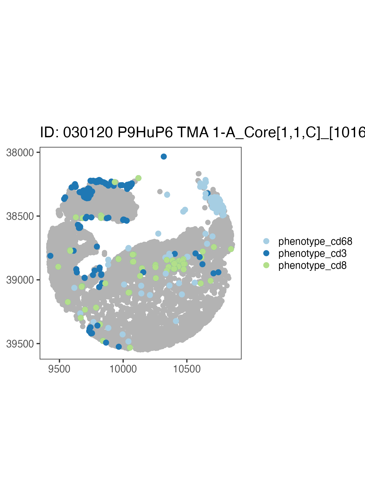
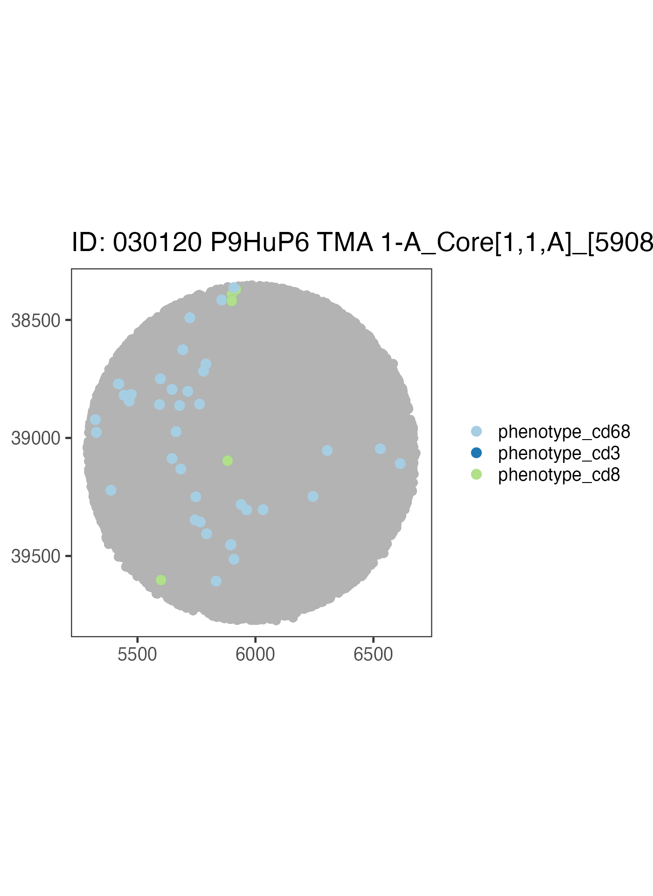
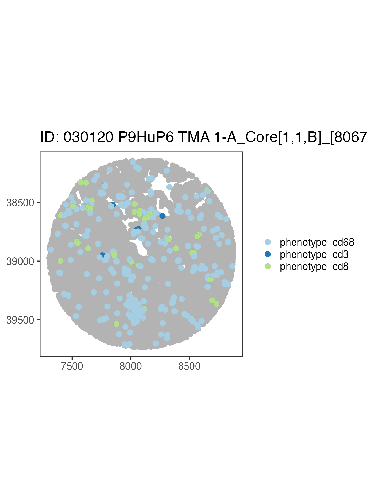
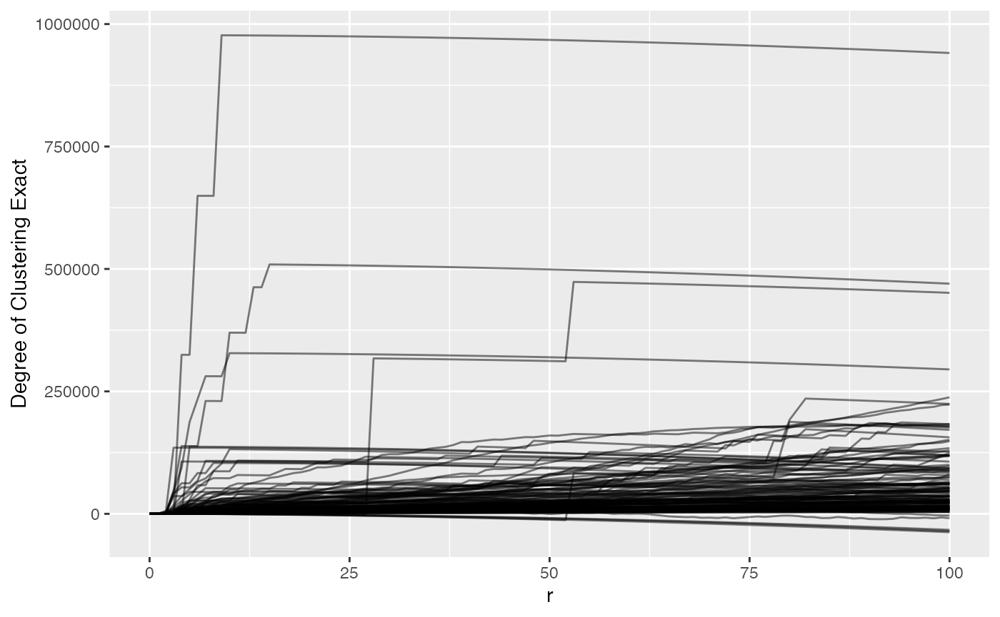
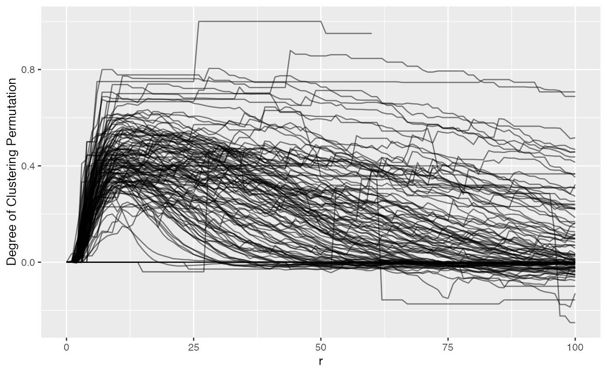
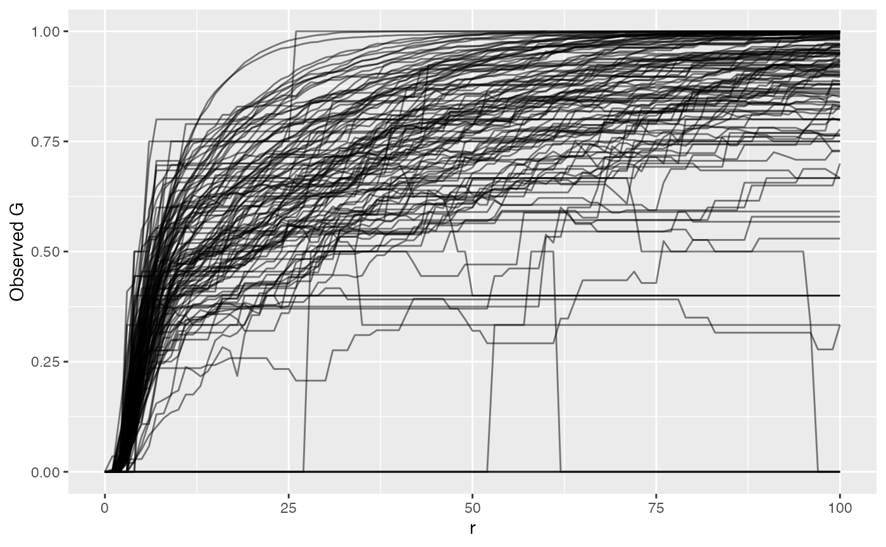

# Using SpatialExperiment objects with spatialTIME

## Multiplex single-cell imaging datasets

We’ll be using data from the [VectraPolarisData Bioconductor
package](https://www.bioconductor.org/packages/release/data/experiment/vignettes/VectraPolarisData/inst/doc/VectraPolarisData.html)
(Wrobel, J and Ghosh, T, 2022). This provides two datasets from the
Vectra Polaris imaging system in the form of SpatialExperiment objects.
[See this vignette for more
details](http://juliawrobel.com/MI_tutorial/MI_VectraPolarisData.md).

These are the packages needed to run this tutorial. These will only be
installed if they are not found in the installed packages.

``` r

if (!("devtools" %in% installed.packages())) {
  install.packages("devtools")
}
if (!("spatialTIME" %in% installed.packages())) {
  devtools::install_github("FridleyLab/spatialTIME", ref = "feature-alex")
}
if (!("BiocManager" %in% installed.packages())) {
  install.packages("BiocManager")
}
if (!("VectraPolarisData" %in% installed.packages())) {
  BiocManager::install("VectraPolarisData")
}
if (!("survival" %in% installed.packages())) {
  BiocManager::install("survival")
}
if (!("lmtest" %in% installed.packages())) {
 install.packages("lmtest")
}
```

    ## Installing package into '/private/var/folders/63/qj4bjln95bs911vg920503rh001s8k/T/RtmpdUJ9CN/temp_libpath566e675d5fe8'
    ## (as 'lib' is unspecified)

    ## also installing the dependency 'zoo'

We’ll need to load these packages. This just means these packages will
be made readily available to us.

``` r

library(ggplot2)
library(dplyr)
```

    ## 
    ## Attaching package: 'dplyr'

    ## The following objects are masked from 'package:stats':
    ## 
    ##     filter, lag

    ## The following objects are masked from 'package:base':
    ## 
    ##     intersect, setdiff, setequal, union

``` r

library(spatialTIME)
```

    ## spatialTIME version:
    ## 2.1.0
    ## If using for publication, please cite our manuscript:
    ## https://doi.org/10.1093/bioinformatics/btab757

``` r

library(survival)
```

## About the data

In this example we will be using data from a [human ovarian cancer
study](https://pubmed.ncbi.nlm.nih.gov/34615692/) (Steinhart et al,
2021).

``` r

# Ovarian cancer example
ovarian <- VectraPolarisData::HumanOvarianCancerVP()
```

    ## see ?VectraPolarisData and browseVignettes('VectraPolarisData') for documentation

    ## loading from cache

For more details on the `SpatialExperiment` class see this [Bioconductor
Vignette](https://www.bioconductor.org/packages/release/bioc/vignettes/SpatialExperiment/inst/doc/SpatialExperiment.html)
and
[preprint](https://www.biorxiv.org/content/10.1101/2021.01.27.428431v3).

We can inspect what this type of object looks like typically by printing
it out below:

``` r

# Use this code chunk to explore the ovarian object.
```

The `colData` entry has a lot of our marker information as well as other
annotations. Let’s specifically look at the `sample_id` and some of the
markers we will be using.

This is how we look at the colData in this set.

``` r

colData(ovarian)[1:5, 1:5]
```

    ## DataFrame with 5 rows and 5 columns
    ##     cell_id tissue_category              slide_id nucleus_area_square_microns
    ##   <numeric>     <character>           <character>                   <numeric>
    ## 1         1          Stroma 030120 P9HuP6 TMA 1-B                         9.4
    ## 2         2           Tumor 030120 P9HuP6 TMA 1-B                        11.1
    ## 3         3          Stroma 030120 P9HuP6 TMA 1-B                         8.9
    ## 4         4          Stroma 030120 P9HuP6 TMA 1-B                         9.8
    ## 5         5          Stroma 030120 P9HuP6 TMA 1-B                        12.1
    ##   nucleus_area_percent
    ##              <numeric>
    ## 1                    0
    ## 2                    0
    ## 3                    0
    ## 4                    0
    ## 5                    0

We can look at the sample IDs by doing this:

``` r

# this is how we can extract sample IDs
head(ovarian$sample_id)
```

    ## [1] "030120 P9HuP6 TMA 1-B_Core[1,1,D]_[12124,35348].im3"
    ## [2] "030120 P9HuP6 TMA 1-B_Core[1,1,D]_[12124,35348].im3"
    ## [3] "030120 P9HuP6 TMA 1-B_Core[1,1,D]_[12124,35348].im3"
    ## [4] "030120 P9HuP6 TMA 1-B_Core[1,1,D]_[12124,35348].im3"
    ## [5] "030120 P9HuP6 TMA 1-B_Core[1,1,D]_[12124,35348].im3"
    ## [6] "030120 P9HuP6 TMA 1-B_Core[1,1,D]_[12124,35348].im3"

There are also marker columns we will need for plotting. They all start
with `phenotype_`

``` r

head(ovarian$phenotype_cd19)
```

    ## [1] ""      ""      ""      "CD19-" "CD19-" "CD19-"

Now to use these data with the spatialTIME package for analyses we will
need to convert it to the MIF (multiplex immunofluorescence) format. For
SpatialExperiment objects specifically we can do this using the
[`spatial_exp_to_mif()`](https://fridleylab.github.io/spatialTIME/reference/spatial_exp_to_mif.md)
function. For all other types of data you can use the
[`create_mif()`](https://fridleylab.github.io/spatialTIME/reference/create_mif.md)
function.

There are three required arguments in this function to create our mif
object. 1) The `SpatialExperiment` object we are using. 2) The name of
the column that links the colData with the spatialCoord data. In this
case it is called “sample_id”. 3) The names of the columns that contain
any markers we’d like to use for the analysis or plotting that are
included in the data as column names.

``` r

# These are the genes we will be using as markers that exist in these data.
markers <- c("phenotype_cd68", "phenotype_cd3", "phenotype_cd8")
```

These objects come with so many columns of data that spatialTIME doesn’t
need, so many will be dropped from the object. But if there is a
particular column you will need for labeling purposes, you can name it
in the `cols_to_keep` variable. But using this argument is optional
rather than required.

Now we can pass all of this into the `spatial_exp_to_mif` function to
create our `mif` object for use with `spatialTIME`.

``` r

ova_mif <- spatial_exp_to_mif(
  spatial_exp = ovarian,
  patient_id = "sample_id",
  markers = markers,
  cols_to_keep = "tissue_category"
)
```

## Plot it

Now we can use our `mif` object to make a set of immunofluorescence
plots, one for each sample in the set.

``` r

ova_mif <- plot_immunoflo(ova_mif,
  plot_title = "sample_id",
  mnames = markers,
  xloc = "x",
  yloc = "y"
)
```

We can view individual plots by pulling them out using the indexing
notation. Where `[[1]]` would be the first sample in the list and
`[[3]]`, the third sample in the list, etc.

``` r

ova_mif$derived$spatial_plots[[3]] +
  ggplot2::coord_equal()
```



Now let’s write our own code to take a look at a different sample using
the above code as a reference.

``` r

ova_mif$derived$spatial_plots[[1]] +
  ggplot2::coord_equal()
```



``` r

ova_mif$derived$spatial_plots[[2]] +
  ggplot2::coord_equal()
```



We could build on to this plot using `ggplot2` and tidyverse code.

## Subset mIF to Single Compartment

We can subset our mif object to a certain compartment. Note this is why
when we made our object we used `cols_to_keep = "tissue_category"`
because we are using that labeling now.

``` r

# filter the mif object to be only the tumor compartment
ova_mif_tumor <- subset_mif(ova_mif,
  classifier = "tissue_category",
  level = "Tumor",
  markers = markers
)
```

Now that we have subset to tumor only, let’s check a spatial data frame
for what levels are in `tissue_category`

``` r

# check a spatial data frame for levels in tissue_category
ova_mif_tumor$spatial[[1]]$tissue_category %>% unique()
```

    ## [1] "Tumor"

Success! We only have cells in a tumor compartment. Summary of the
samples has also been updated to reflect the new compartment.

``` r

names(ova_mif_tumor$sample)
```

    ## [1] "patient_id"              "sample_id"              
    ## [3] "Tumor: phenotype_cd68"   "Tumor: phenotype_cd3"   
    ## [5] "Tumor: phenotype_cd8"    "Tumor: Total Cells"     
    ## [7] "Tumor: % phenotype_cd68" "Tumor: % phenotype_cd3" 
    ## [9] "Tumor: % phenotype_cd8"

END OF OFFICIAL INSTRUCTION

## Ripley’s K

Now we can use the Ripley’s K stat to quantify our spatial clustering.

``` r

# takes time to process all samples
ova_mif_tumor <- ripleys_k(ova_mif_tumor,
  mnames = markers,
  r_range = 0:100,
  edge_correction = "translation", # translational edge correction
  permute = FALSE, # allows for exact estimation of complete spatial ransomness, or CSR
  workers = 1, # depending on number of spatial samples and ram, may cause crashes if overallocated
  big = 50000, # really only needed (keep larger than largest spatial data) when computer has ram limitations otherwise would avoid, causes non-perfect estimation of CSR due to rounding/edge corrections
  xloc = "x",
  yloc = "y",
  overwrite = TRUE
)
```

Now that we’ve run Ripley’s K, let’s plot `phenotype_cd3` to view t-cell
clustering

``` r

ova_mif_tumor$derived$univariate_Count %>%
  filter(Marker == "phenotype_cd3") %>%
  ggplot() +
  geom_line(aes(x = r, y = `Degree of Clustering Exact`,
                group = sample_id),
    alpha = 0.5
  )
```

    ## Warning: Removed 202 rows containing missing values or values outside the scale range
    ## (`geom_line()`).



We can see that most samples have a positive ‘degree of clustering’
meaning that the T cells in the most samples are clustering closer
together than expected if they were randomly distributed around the
samples. We also see that there are 202 rows that have missing values,
i.e. the spatial files didn’t have enough positive cells for a marker.

## Nearest Neighbor G

Alternatively we can use Nearest Neighbor G to examine clustering which
identifies the probability of encountering a neighbor cell.

``` r

ova_mif_tumor <- NN_G(
  mif = ova_mif_tumor,
  mnames = markers,
  r_range = 0:100,
  num_permutations = 10, # NN G(r) requires permutations to estimate CSR
  edge_correction = "rs", # reduced sampling edge correction
  keep_permutation_distribution = FALSE, # whether to keep results from each permutation
  workers = 1,
  overwrite = TRUE,
  xloc = "x",
  yloc = "y"
)
```

Now let’s plot `phenotype_cd3` again but with NNG results to view t-cell
clustering.

``` r

ova_mif_tumor$derived$univariate_NN %>%
  filter(Marker == "phenotype_cd3") %>%
  ggplot() +
  geom_line(aes(x = r, y = `Degree of Clustering Permutation`, group = sample_id),
    alpha = 0.5
  )
```

    ## Warning: Removed 242 rows containing missing values or values outside the scale range
    ## (`geom_line()`).



We can see NN G(r) is much more ‘curvy’ than Ripley’s K. Values above 0
suggest clustering more than expected if the T cells were random. We
also can vaguely see that there is a bit of a hill between 0 and 25,
indicating tight clusters of CD3, then outside of that they either fall
to 0 or maintain their degree of clustering. NN G(r) (observed) tells
the proportion of T cells with a neighbor at or below a measured radius.

``` r

ova_mif_tumor$derived$univariate_NN %>%
  filter(Marker == "phenotype_cd3") %>%
  ggplot() +
  geom_line(aes(x = r, y = `Observed G`, group = sample_id),
    alpha = 0.5
  )
```

    ## Warning: Removed 242 rows containing missing values or values outside the scale range
    ## (`geom_line()`).



By plotting the raw NN G(r) value, we see that it grows and approaches
1, at which point all T cells in the sample have another T cell within
that radius. Or 75% of T cells have another T cell within whatever
radius. The reason we take the difference between observed and permuted
(Degree of Clustering Permutation) is to account for sample-specific
technical artifacts like holes or even necrotic regions that violate
what Ripley’s K and NN G assume of the sample. This difference is then
what we compare between samples.

## Picking a Radius - Ripley’s K

Unless diving into complicated statistics with functional data analysis
(analysis of the entire shape of the Ripley’s K or NN G curve),
researchers have to pick a radius that they would like to associate with
some feature of the samples like patient survival, stage, treatment
response, or even disease subtypes.

The best way to do this is to plot all curves for a marker and find a
radius that’s small enough to be biologically meaningful while large
enough to capture variance in the data.

Let’s plot phenotype_cd3 to view t-cell clustering again to take a look.

``` r

ova_mif_tumor$derived$univariate_Count %>%
  filter(Marker == "phenotype_cd3") %>%
  ggplot() +
  geom_line(aes(x = r, y = `Degree of Clustering Exact`, group = sample_id),
    alpha = 0.5
  )
```

    ## Warning: Removed 202 rows containing missing values or values outside the scale range
    ## (`geom_line()`).


For this data, we might pick a radius of 50 pixels because after that
most values don’t drastically change, so we can subset and move forward.

``` r

analysis_dat <- ova_mif_tumor$derived$univariate_Count %>%
  filter(Marker == "phenotype_cd3", r == 50) %>% # filter ripley's k output to CD3 cells and radius of 50
  full_join(
    ova_mif_tumor$clinical, # merge with clinical (on left side)
    ., by = c("patient_id" = "sample_id")) # ripleys k on right

head(analysis_dat)
```

    ##                                            patient_id tma
    ## 1 030120 P9HuP6 TMA 1-B_Core[1,1,D]_[12124,35348].im3   1
    ## 2 030120 P9HuP6 TMA 1-B_Core[1,1,E]_[14220,35348].im3   1
    ## 3 030120 P9HuP6 TMA 1-B_Core[1,1,F]_[16379,35348].im3   1
    ## 4 030120 P9HuP6 TMA 1-B_Core[1,1,G]_[18601,35348].im3   1
    ## 5 030120 P9HuP6 TMA 1-B_Core[1,1,H]_[20633,35348].im3   1
    ## 6  030120 P9HuP6 TMA 1-B_Core[1,1,B]_[7934,35665].im3   1
    ##                                                      diagnosis primary
    ## 1                       Recurrent primary peritoneal carcinoma       0
    ## 2           Papillary serous adenocarcinoma of ovarian surface       1
    ## 3                                        serous adenocarcinoma       1
    ## 4                                 Primary peritoneal carcinoma       1
    ## 5 Post-Treatment High grade serous carcinoma of the peritoneum       1
    ## 6                                  High grade serous carcinoma       1
    ##   recurrent treatment_effect stage grade survival_time death BRCA_mutation
    ## 1         1                0     3     3            68     1             1
    ## 2         0                0     3     3            37     1             0
    ## 3         0                0     3     3            76     0             0
    ## 4         0                0     3     3            22     1            NA
    ## 5         0                1     4     3            70     0             0
    ## 6         0                0     3     2            46     0             0
    ##   age_at_diagnosis time_to_recurrence parpi_inhibitor debulking        Marker
    ## 1               47                 25               Y   Optimal phenotype_cd3
    ## 2               53                 20               Y   Optimal phenotype_cd3
    ## 3               53      No_Recurrence               Y  Interval phenotype_cd3
    ## 4               54                  9               N   Optimal phenotype_cd3
    ## 5               50                 31               N  Interval phenotype_cd3
    ## 6               69                 39               Y   Optimal phenotype_cd3
    ##       iter  r Theoretical CSR Permuted CSR Exact CSR Observed K
    ## 1 Estimate 50        7853.982           NA 10651.873   29017.89
    ## 2 Estimate 50        7853.982           NA 10014.605   52929.95
    ## 3 Estimate 50        7853.982           NA  8085.531   13699.08
    ## 4 Estimate 50        7853.982           NA 12436.604  137283.93
    ## 5 Estimate 50        7853.982           NA 11713.179   20728.65
    ## 6 Estimate 50        7853.982           NA 11249.827  135060.12
    ##   Permutations Larger than Observed Degree of Clustering Theoretical
    ## 1                                NA                        21163.906
    ## 2                                NA                        45075.972
    ## 3                                NA                         5845.099
    ## 4                                NA                       129429.946
    ## 5                                NA                        12874.672
    ## 6                                NA                       127206.141
    ##   Degree of Clustering Permutation Degree of Clustering Exact Run
    ## 1                               NA                  18366.015   1
    ## 2                               NA                  42915.348   1
    ## 3                               NA                   5613.550   1
    ## 4                               NA                 124847.324   1
    ## 5                               NA                   9015.475   1
    ## 6                               NA                 123810.296   1

## Performing Association with Survival

For simplicity we can dichotomize the clustering values.

``` r

analysis_dat <- analysis_dat %>%
  mutate(
    cluster_group = ifelse(`Degree of Clustering Exact` >= median(`Degree of Clustering Exact`, na.rm = TRUE), # remembering that 2 samples didn't have enough T cells so remove NA
      "High Clustering",
      "Low Clustering"
    ), # if above the median, high, else low
    cluster_group = factor(cluster_group, levels = c("Low Clustering", "High Clustering"))
  ) %>% # convert to factor to control reference
  filter(!is.na(cluster_group)) # must remove extra rows that do not have clustering group
```

Create a formula using column names in `analysis_data`.

``` r

form1 <- formula(Surv(survival_time, as.numeric(death)) ~ age_at_diagnosis + stage + grade + cluster_group)
```

Now let’s fit the model using Cox proportional hazards regression model
using the `survival` package.

``` r

# fit the model with the data
model1 <- coxph(form1, data = analysis_dat)
```

We can take a look at the summary of this fitting.

``` r

# view the fit
summary(model1)
```

    ## Call:
    ## coxph(formula = form1, data = analysis_dat)
    ## 
    ##   n= 126, number of events= 79 
    ## 
    ##                                  coef exp(coef) se(coef)      z Pr(>|z|)  
    ## age_at_diagnosis              0.01334   1.01342  0.01211  1.101   0.2709  
    ## stage2                       -0.09165   0.91242  1.23729 -0.074   0.9410  
    ## stage3                        1.27547   3.58038  1.03245  1.235   0.2167  
    ## stage4                        2.04767   7.74980  1.11641  1.834   0.0666 .
    ## grade                        -0.37427   0.68779  0.48848 -0.766   0.4436  
    ## cluster_groupHigh Clustering  0.43714   1.54828  0.24070  1.816   0.0694 .
    ## ---
    ## Signif. codes:  0 '***' 0.001 '**' 0.01 '*' 0.05 '.' 0.1 ' ' 1
    ## 
    ##                              exp(coef) exp(-coef) lower .95 upper .95
    ## age_at_diagnosis                1.0134     0.9868   0.98965     1.038
    ## stage2                          0.9124     1.0960   0.08073    10.313
    ## stage3                          3.5804     0.2793   0.47327    27.087
    ## stage4                          7.7498     0.1290   0.86897    69.116
    ## grade                           0.6878     1.4539   0.26404     1.792
    ## cluster_groupHigh Clustering    1.5483     0.6459   0.96597     2.482
    ## 
    ## Concordance= 0.61  (se = 0.037 )
    ## Likelihood ratio test= 17.41  on 6 df,   p=0.008
    ## Wald test            = 14.9  on 6 df,   p=0.02
    ## Score (logrank) test = 16.07  on 6 df,   p=0.01

We see that stage 4 has moderately worse survival than stage 1
(reference) but not significant based on exp(coef) hazard ratio
(exp\[-coef\]) = 7.75, 95% confidence interval (0.869, 69.116) We also
see that high clustering has a moderately worse survival than the low
clustering hazard ratio (exp\[-coef\]) = 1.55, 95% confidence interval
(0.966, 2.482)

We can also see whether or not adding the clustering to the model
formula significantly improves the model fit to the data. This must be
done with a nested formula, i.e. removing or adding a column to the
formula to assess impact of the addition or removal. Here we just remove
the `clustering_group` and fit another model.

Again, create a formula using column names in `analysis_data`, just
remove the `clustering_group`.

``` r

form2 <- formula(Surv(survival_time, as.numeric(death)) ~ age_at_diagnosis + stage + grade)
```

Now we can fit the model with the data in the same way as we did
previously.

``` r

# fit the model with the data
model2 <- coxph(form2, data = analysis_dat)
```

To identify the significance of including clustering, we can perform a
likelihood ratio test comparing the two models.

``` r

lrt <- lmtest::lrtest(
  model2,
  model1
)

# Let's print it out
lrt
```

    ## Likelihood ratio test
    ## 
    ## Model 1: Surv(survival_time, as.numeric(death)) ~ age_at_diagnosis + stage + 
    ##     grade
    ## Model 2: Surv(survival_time, as.numeric(death)) ~ age_at_diagnosis + stage + 
    ##     grade + cluster_group
    ##   #Df  LogLik Df  Chisq Pr(>Chisq)  
    ## 1   5 -314.67                       
    ## 2   6 -312.99  1 3.3613    0.06674 .
    ## ---
    ## Signif. codes:  0 '***' 0.001 '**' 0.01 '*' 0.05 '.' 0.1 ' ' 1

Based on this output, we can see probability between these two models is
0.07, so it doesn’t appear that adding in the spatial information
significantly improves the survival model fit for the data.

## Session info

``` r

sessionInfo()
```

    ## R version 4.6.1 (2026-06-24)
    ## Platform: aarch64-apple-darwin24.6.0
    ## Running under: macOS Sequoia 15.7.9
    ## 
    ## Matrix products: default
    ## BLAS:   /opt/homebrew/Cellar/openblas/0.3.33/lib/libopenblasp-r0.3.33.dylib 
    ## LAPACK: /opt/homebrew/Cellar/r/4.6.1/lib/R/lib/libRlapack.dylib;  LAPACK version 3.12.1
    ## 
    ## locale:
    ## [1] en_US.UTF-8/en_US.UTF-8/en_US.UTF-8/C/en_US.UTF-8/en_US.UTF-8
    ## 
    ## time zone: America/New_York
    ## tzcode source: internal
    ## 
    ## attached base packages:
    ## [1] stats4    stats     graphics  grDevices utils     datasets  methods  
    ## [8] base     
    ## 
    ## other attached packages:
    ##  [1] VectraPolarisData_1.16.0    SpatialExperiment_1.22.0   
    ##  [3] SingleCellExperiment_1.34.0 SummarizedExperiment_1.42.0
    ##  [5] Biobase_2.72.0              GenomicRanges_1.64.0       
    ##  [7] Seqinfo_1.2.0               IRanges_2.46.0             
    ##  [9] S4Vectors_0.50.2            MatrixGenerics_1.24.0      
    ## [11] matrixStats_1.5.0           ExperimentHub_3.2.2        
    ## [13] AnnotationHub_4.2.2         BiocFileCache_3.2.0        
    ## [15] dbplyr_2.6.0                BiocGenerics_0.58.1        
    ## [17] generics_0.1.4              survival_3.8-6             
    ## [19] spatialTIME_2.1.0           dplyr_1.2.1                
    ## [21] ggplot2_4.0.3              
    ## 
    ## loaded via a namespace (and not attached):
    ##  [1] DBI_1.3.0              deldir_2.0-4           httr2_1.3.0           
    ##  [4] rlang_1.3.0            magrittr_2.0.5         otel_0.2.0            
    ##  [7] compiler_4.6.1         RSQLite_3.53.3         spatstat.geom_3.8-2   
    ## [10] png_0.1-9              systemfonts_1.3.2      pbmcapply_1.5.1       
    ## [13] vctrs_0.7.3            pkgconfig_2.0.3        crayon_1.5.3          
    ## [16] fastmap_1.2.0          magick_2.9.1           XVector_0.52.0        
    ## [19] labeling_0.4.3         rmarkdown_2.31         ragg_1.5.2            
    ## [22] purrr_1.2.2            bit_4.6.0              xfun_0.60             
    ## [25] cachem_1.1.0           jsonlite_2.0.0         goftest_1.2-3         
    ## [28] blob_1.3.0             DelayedArray_0.38.2    spatstat.utils_3.2-4  
    ## [31] parallel_4.6.1         R6_2.6.1               bslib_0.12.0          
    ## [34] RColorBrewer_1.1-3     spatstat.data_3.1-9    spatstat.univar_3.2-0 
    ## [37] lmtest_0.9-40          jquerylib_0.1.4        Rcpp_1.1.2            
    ## [40] knitr_1.51             tensor_1.5.1           zoo_1.9-0             
    ## [43] Matrix_1.7-5           splines_4.6.1          tidyselect_1.2.1      
    ## [46] abind_1.4-8            yaml_2.3.12            spatstat.random_3.5-1 
    ## [49] spatstat.explore_3.8-2 curl_8.0.0             lattice_0.22-9        
    ## [52] tibble_3.3.1           withr_3.0.3            KEGGREST_1.52.2       
    ## [55] S7_0.2.2               evaluate_1.0.5         desc_1.4.3            
    ## [58] polyclip_1.10-7        Biostrings_2.80.2      pillar_1.11.1         
    ## [61] BiocManager_1.30.27    filelock_1.0.3         BiocVersion_3.23.1    
    ## [64] scales_1.4.0           glue_1.8.1             tools_4.6.1           
    ## [67] fs_2.1.0               grid_4.6.1             tidyr_1.3.2           
    ## [70] AnnotationDbi_1.74.0   nlme_3.1-169           cli_3.6.6             
    ## [73] spatstat.sparse_3.2-0  rappdirs_0.3.4         textshaping_1.0.5     
    ## [76] S4Arrays_1.12.0        gtable_0.3.6           sass_0.4.10           
    ## [79] digest_0.6.39          SparseArray_1.12.2     rjson_0.2.23          
    ## [82] htmlwidgets_1.6.4      farver_2.1.2           memoise_2.0.1         
    ## [85] htmltools_0.5.9        pkgdown_2.2.1          lifecycle_1.0.5       
    ## [88] httr_1.4.9             bit64_4.8.6
